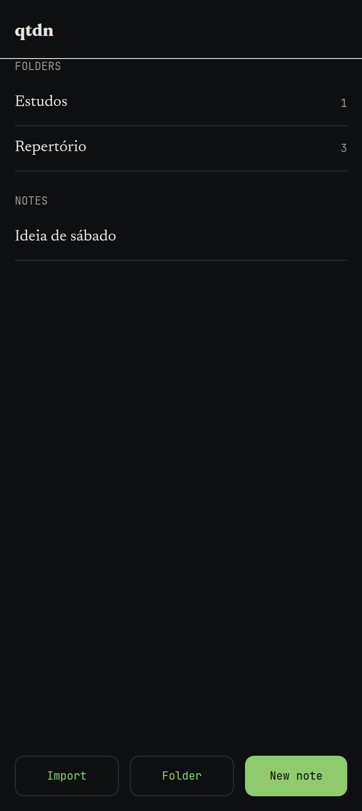
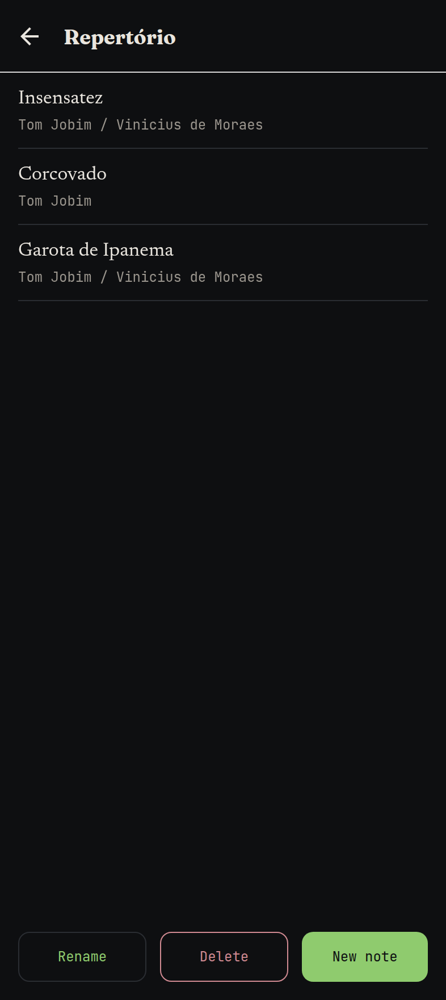
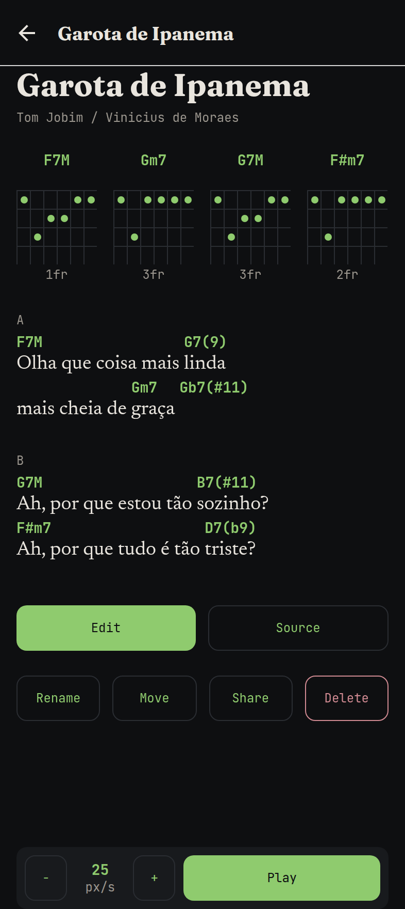
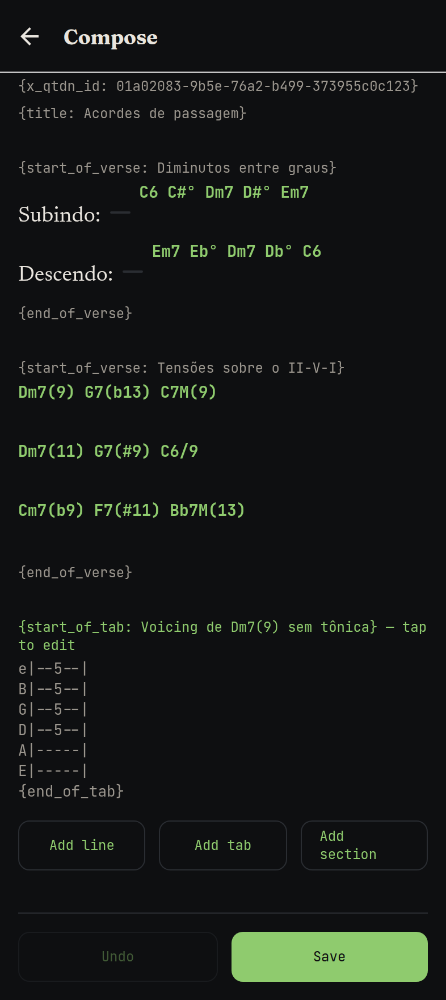
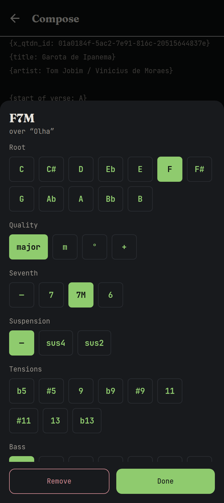
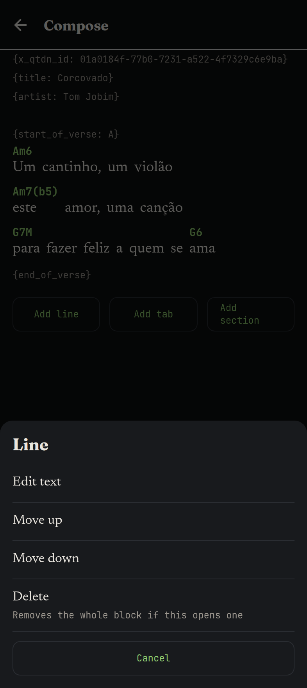
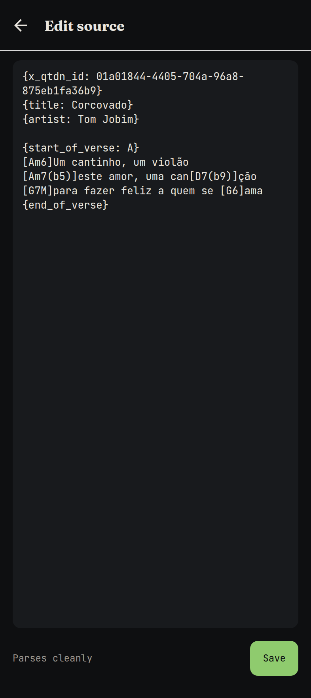
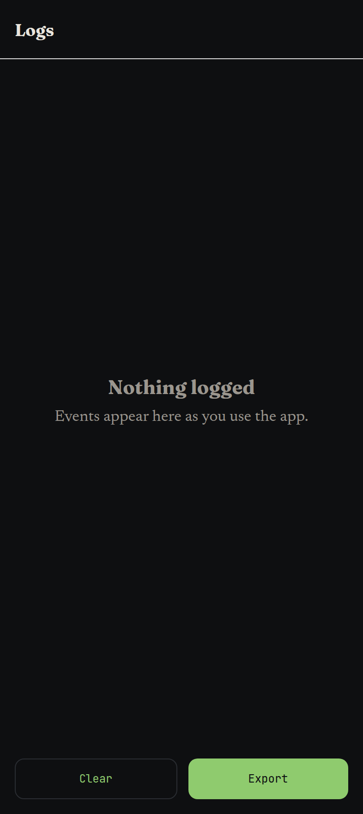
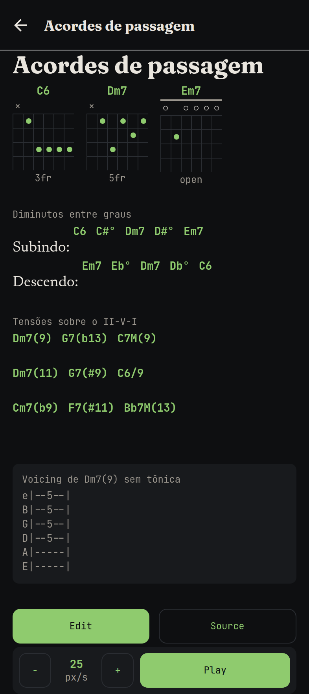
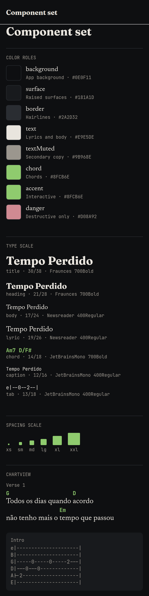

# qtdn

A minimalist iOS app for quick acoustic-guitar annotations: chords over lyrics, tabs, and
short audio references, organized in folders.

Design and rationale live in [`docs/DESIGN.md`](docs/DESIGN.md).

## Status

**v0 is complete.** Notes and folders can be created, edited, organised, played and moved
in and out of the app as files. Audio and video attachments are P1 and deliberately
absent — they are also the one thing that would end Expo Go compatibility, so until then
the app runs by scanning a QR code.

## Layout

```
packages/chordpro/   Pure TypeScript. The note format: AST, parser, serializer, queries.
apps/mobile/         The Expo app: design tokens, component set, screens.
docs/                Design document and, later, architecture decision records.
```

`packages/chordpro` imports nothing from React, React Native or Expo, and a lint rule
fails CI if that ever changes. It runs under plain Node in tests with no mocking, and
stays reusable by a web client or a server later.

## Getting started

Requires Node 22+ and, to run on a device, Xcode.

```bash
npm install
npm run check          # lint, typecheck and unit tests
npm start --workspace @qtdn/mobile
```

**Today, Expo Go works.** Every current dependency ships inside it, so the fastest way
onto a phone is `npm start --workspace @qtdn/mobile` and scanning the QR code.

That stops being true the moment the Voice Memos share extension lands, since Expo Go
cannot host a native module it wasn't built with. From then on qtdn needs a development
build: `npm run ios --workspace @qtdn/mobile` compiles and installs one on a simulator or
a connected device.

## Commands

| Command | What it does |
|---|---|
| `npm run lint` | ESLint across the workspace, including the architecture rules |
| `npm run typecheck` | `tsc` over the domain package and the app |
| `npm run test` | Vitest unit and property tests |
| `npm run test:coverage` | The same, with thresholds enforced |
| `npm run build:ios` | Bundles the app through Metro, exactly as a release build does |
| `npm run e2e` | Drives the real app through its own controls in a browser |
| `npm run e2e:report` | Opens the HTML report from the last end-to-end run |
| `npm run latency` | Measures the operations that touch every note, as the library grows |

`npm run e2e` needs a chromium — either `npx playwright install chromium` once, or
`CHROMIUM_PATH` pointing at one you already have.

The suite runs against the web export, whose file store is in memory and seeded with the
demo library, so every test starts from the same library and none can see another's
writes. It earns its place in CI: both bugs it has found — a screen still showing the
version of a note from before an edit, an editor writing a stale buffer over a tab that
had just been added — passed every unit test first. Integration is exactly what 100%
coverage cannot see. `e2e/CLAUDE.md` has the rest.

## The note format

A note is a plain-text file in a ChordPro superset. It is the source of truth; SQLite is
a derived index, rebuildable from the files at any time.

```chordpro
{title: Tempo Perdido}
{start_of_verse: Verse 1}
[G]Todos os dias quando [D]acordo
{end_of_verse}
```

qtdn-specific directives are namespaced `x_qtdn_*` so other ChordPro tools read our files
and ignore what they don't recognize. Unknown directives round-trip unharmed, which is
what lets an older client open and save a note written by a newer one without losing data.

The property that everything else depends on is that `parse` and `serialize` are
inverses. Three editing modes — structured, tab, and raw — read and write the same AST,
so if that invariant broke, an edit made in one mode would silently corrupt the note when
saved from another. It is tested with generated charts in
`packages/chordpro/test/roundtrip.test.ts` and is not allowed to regress.

## Screens

| Library | Folder | Song |
|---|---|---|
|  |  |  |

| Compose | Chord builder | Line menu |
|---|---|---|
|  |  |  |

| Raw source | Logs | Tensions |
|---|---|---|
|  |  |  |

The song screen carries the chord diagrams for the chords it uses and an auto-scroll bar.
Chords are placed by tapping the word they sit above and building a symbol from its parts;
the raw editor is the escape hatch for pasting a chart off the web.

## Component set

The gallery route renders every token and component in one place, so the visual language
can be judged as a set rather than one screen at a time. When the component set grows, it
grows here first.


